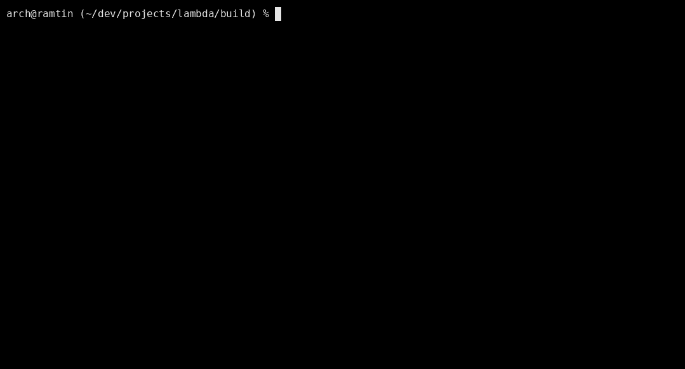

# Lambda λ
> A cross-platform recursive-descent math interpreter written in C.
## 📸 Preview



## 📦 Build

```bash
git clone https://github.com/cron0s-dev/lambda.git
cd ./lambda
cmake -B build -G Ninja
cd build
ninja
```
